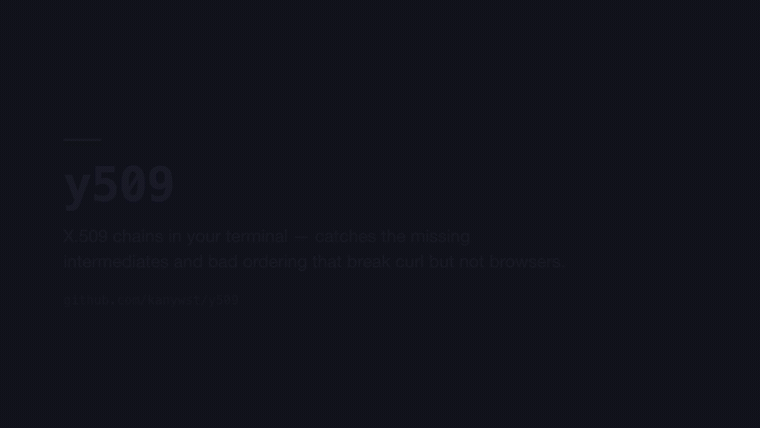

[](https://github.com/kanywst/matinee/actions/workflows/ci.yml)
[](LICENSE)

# matinee

Turn a [VHS](https://github.com/charmbracelet/vhs) `.tape` into a narrated, chaptered demo video.

[Quick start](#quick-start) · [Adding your repo](#adding-your-repo) · [How it works](#how-it-works) · [Limitations](#limitations)

> The GIF above is silent, because GIFs are. The real output has a voice track, word-synced captions and per-chapter framing — which is the whole point, and the one thing a GIF cannot show you.

## What it does

- **Reuses the tape you already have.** If your repo records a README GIF with VHS, matinee builds a video from the same file. No second script to keep in sync.
- **Chapters come from your tape's comments.** `# Search` above a step becomes a chapter. You never write a timestamp.
- **Narration is yours, timing is derived.** You write one line per chapter; it gets spoken, laid down at that chapter's start, and captioned word-by-word from the audio that was actually produced.
- **16:9 and 9:16 from one source.** The vertical cut can zoom to whichever pane each chapter is about, so a dense TUI stays readable on a phone.
- **Local and free.** No API key. Recording, narration, captions and rendering all run on your machine.

## Quick start

```bash
git clone https://github.com/kanywst/matinee && cd matinee
npm install
make video PROJECT=y509
```

`out/y509-16x9.mp4` and `out/y509-9x16.mp4`.

Three worked examples ship in `projects/`: [y509](https://github.com/kanywst/y509), [prpr](https://github.com/kanywst/prpr) and [brtc](https://github.com/kanywst/brtc). Their tapes disagree about theme, resolution, framerate and comment style, which is deliberate — that variety is what the parser is built against.

## Install

### macOS

```bash
brew install vhs ffmpeg whisper.cpp
npm install

# whisper model for captions
mkdir -p ~/.cache/whisper && cd ~/.cache/whisper
curl -LO https://huggingface.co/ggerganov/whisper.cpp/resolve/main/ggml-base.en.bin
```

Narration uses the built-in `say`. Nothing else to install.

### Linux

```bash
# vhs needs ttyd and ffmpeg; see charmbracelet/vhs for your distro
sudo apt-get install -y ffmpeg espeak-ng
npm install

mkdir -p ~/.cache/whisper && cd ~/.cache/whisper
curl -LO https://huggingface.co/ggerganov/whisper.cpp/resolve/main/ggml-base.en.bin
```

For narration, either `espeak-ng` (installed above — robotic but instant) or [piper](https://github.com/rhasspy/piper) for something listenable:

```bash
uv tool install piper-tts
mkdir -p ~/.cache/piper && cd ~/.cache/piper
curl -LO https://huggingface.co/rhasspy/piper-voices/resolve/main/en/en_US/lessac/medium/en_US-lessac-medium.onnx
curl -LO https://huggingface.co/rhasspy/piper-voices/resolve/main/en/en_US/lessac/medium/en_US-lessac-medium.onnx.json
```

### Japanese narration

```bash
docker run -d --name voicevox -p 50021:50021 voicevox/voicevox_engine:cpu-latest
```

Set `lang: ja` in your `script.yaml`. Captions need the multilingual whisper model (`ggml-base.bin`) rather than `ggml-base.en.bin`.

**Each VOICEVOX character has its own terms of use.** Check the one you pick before publishing anything.

Python runs through [uv](https://docs.astral.sh/uv/) — each script declares its own dependencies inline, so there is no environment to create.

## Adding your repo

**1.** Write `projects/<id>/script.yaml`:

```yaml
id: y509
title: y509
subtitle: X.509 chains in your terminal.
repo: github.com/kanywst/y509
accent: "#a6e3a1"
lang: en

source:
  repoDir: ~/y509
  tapeRel: demo.tape

narration:
  Launch: y509 opens any certificate chain in your terminal.
  Search: Search jumps straight to a certificate.

# Optional, 9:16 only: zoom to the part of the screen each chapter is about.
crop:
  Search: { x: 0.14, y: 0.24, w: 0.72, h: 0.46 }
```

Keys under `narration` and `crop` are chapter titles. A chapter you leave out plays silent, or unzoomed, which is often the right answer.

**2.** Add two lines to `projects/registry.ts` — an import and an array entry.

**3.** `make video PROJECT=<id>`

### What your tape needs

Chapters come from section comments:

- A **numbered** comment is always a section: `# 3. Search`.
- An **unnumbered** comment is a section when it stands alone on one line. A block of several consecutive comment lines is prose and is ignored — that is how the explanatory paragraphs in real tapes stay out of the chapter list.
- A tape with no section comments is an error, not an empty video.

If your tape assumes a built binary, build it first. matinee runs the tape verbatim and builds nothing for you.

## How it works

```text
your-repo/demo.tape
        │
        ├─ record    run the tape, encode the frames          → terminal.mp4
        ├─ build     chapter titles + timings, from the tape  → project.json
        ├─ narrate   your lines, spoken                       → narration.wav
        ├─ captions  word-level timings, from the audio       → project.json
        └─ render    composite, both aspect ratios            → out/*.mp4
```

Each step is a `make` target, so you can rerun just the one you changed. `make studio` opens the [Remotion](https://www.remotion.dev) studio to preview interactively.

**The tape is the source of truth.** Chapter titles and timings are derived from it, which means editing the demo moves the chapters with it. Narration does not follow automatically — a renamed section drops its line with a warning.

**Captions transcribe the audio, not the script.** That gets the real timings, including the pauses the voice chose. The cost is that a word the TTS slurs comes back misspelled; read them before publishing.

**Timings are estimated, then scaled.** The tape walk models typing and sleeps but not render time, so it over-shoots; the marks are scaled to the recording's measured length.

## Limitations

- **VHS's own encoders can fail silently.** VHS v0.12.0 shells out to ffmpeg for GIF and MP4, and against ffmpeg 9.x that call writes nothing while still logging "Creating …" and exiting 0. matinee sidesteps it by taking VHS's PNG frame output and encoding that itself — which also means the window chrome VHS would have drawn is redrawn in `TerminalStage.tsx`.
- **The recording is not reproducible.** A tape may fetch and build before it records, so clip length depends on the machine and on cache state. That is why the chapter marks are scaled to the measured duration rather than trusted from the estimate.
- **Chapter timings drift within a tape.** Scaling corrects the total, not a demo with one unusually slow step.
- **`say` is macOS-only**, and `espeak` sounds like 1998. Linux narration worth listening to means installing piper.

## Contributing

See [CONTRIBUTING.md](CONTRIBUTING.md). The most useful thing you can send is **a tape matinee gets wrong** — every bug the parser has had came from a real tape doing something reasonable it did not expect.

## License

[MIT](LICENSE).

matinee renders with [Remotion](https://www.remotion.dev), which is **not** MIT: it is free for individuals, non-profits, and companies with up to three employees, and larger organisations need a [company licence](https://www.remotion.dev/docs/licensing). Check where you fall before using this at work.
